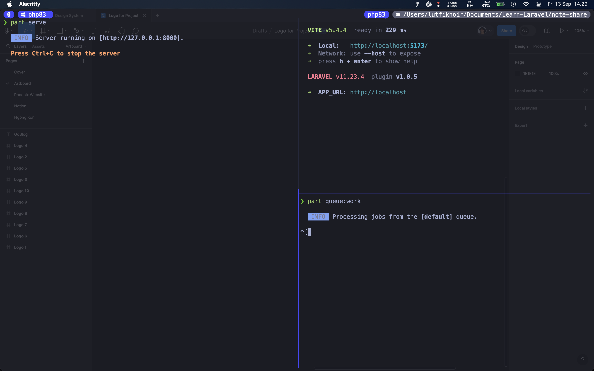
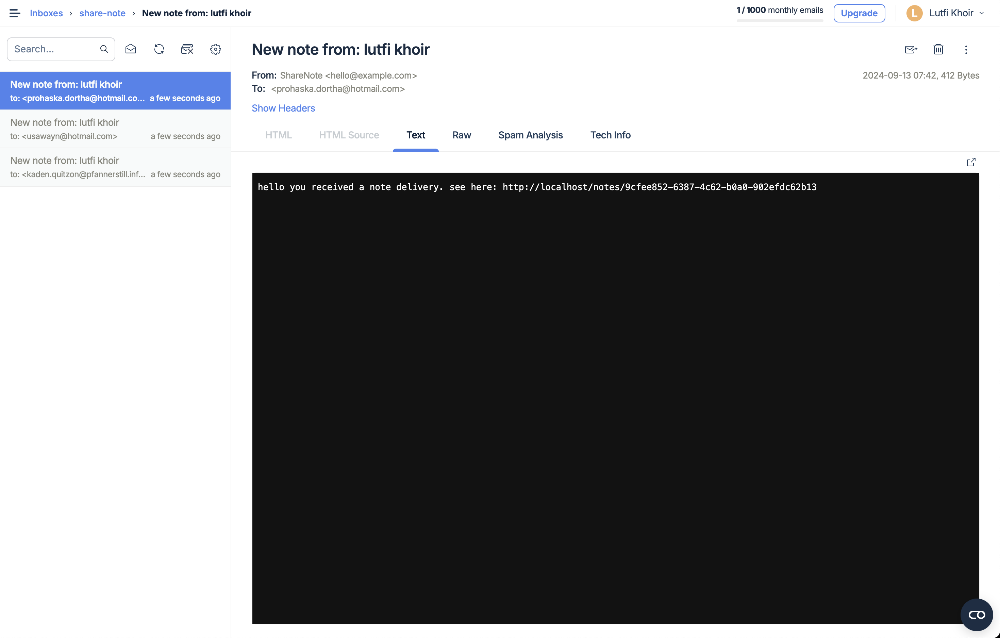

<p align="center">
  
</p>

# About ShareNote

ShareNote is a note-sharing application built with the TALL stack (Tailwind CSS, Alpine.js, Laravel, Livewire) and enhanced with Laravel Breeze and Wire UI. It allows users to create, read, update, and delete notes, as well as share them via email to specified addresses.

## Tech Stack

<p align="center">
  
  
  
  
  
  
</p>

## Features

-   **CRUD Operations**: Create, read, update, and delete personal notes.
-   **Email Sharing**: Send notes to specified email addresses.
-   **Privacy Control**: Only published notes are visible to other users.
-   **Author-only Editing**: Ensures that only the note's author can make edits.
-   **Scheduled Emails**: Automated email sending based on user-defined schedules.

## Installation

1. Clone the repository:

    ```
    git clone https://github.com/asiata25/note-share.git
    ```

2. Navigate to the project directory:

    ```
    cd note-share
    ```

3. Install PHP dependencies:

    ```
    composer install
    ```

4. Install JavaScript dependencies:

    ```
    npm install
    ```

5. Copy the `.env.example` file to `.env` and configure your database settings.

6. Generate an application key:

    ```
    php artisan key:generate
    ```

7. Run database migrations:

    ```
    php artisan migrate
    ```

8. Pre-prepared Account:
   The login credentials and other details for this pre-prepared account can be found in [here](database/seeders/DatabaseSeeder.php).

## Email Configuration (Mailtrap)

To set up email functionality using Mailtrap:

1. Visit https://mailtrap.io/ and register for a new account.
2. Go to Email Testing and click "Add Inbox". Name it after your application.
3. Click on the newly created inbox and find the "Integrations" dropdown.
4. Select "Laravel 9+" from the list to get the configuration code.
5. Copy the provided credentials and replace the corresponding variables in your `.env` file:

    ```
    MAIL_MAILER=smtp
    MAIL_HOST=sandbox.smtp.mailtrap.io
    MAIL_PORT=2525
    MAIL_USERNAME=your_username
    MAIL_PASSWORD=your_password
    ```

## Running the Application

1. Start the Laravel development server:

    ```
    php artisan serve
    ```

2. In a new terminal, compile and watch for asset changes:

    ```
    npm run dev
    ```

3. In another terminal, start the queue worker for processing scheduled emails:
    ```
    php artisan queue:work
    ```

    ### Terminal preview

    
The application should now be running at `http://localhost:8000`.

## Scheduled Tasks

Email scheduling is configured in [bootstrap/app.php](bootstrap/app.php). Review this file to understand or modify the scheduling logic.

 _by default The schedule is set automatically every day at 9 am WIB. But you can change some of the note dates today, and run the command code below on another terminal_
```
php artisan app:send-scheduled-note
```
and you will be able to see incoming emails in your mailtrap account
<br/>
<br/>

<br/>
<br/>
<p align="center">
<a href="https://lutfikhoir.com/"></a>
<a href="https://www.linkedin.com/in/lutfi-khoir-632524235/"></a>
<a href="https://www.instagram.com/lutfi.khoirudin/"></a>
<a href="https://www.youtube.com/@lutfikhoir2502"></a>

</p>
